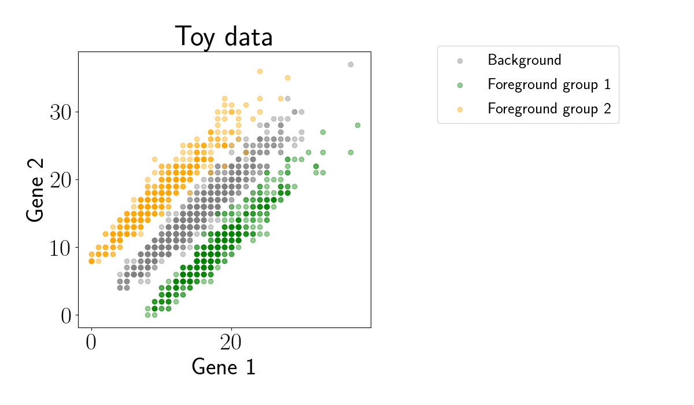
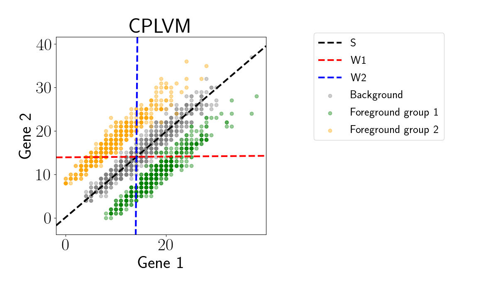

# [Contrastive Poisson latent variable models](https://arxiv.org/abs/2102.06731)
[](https://travis-ci.com/github/andrewcharlesjones/cplvm)

This repo contains models and algorithms for contrastive Poisson latent variable models (CPLVM). Given a count-based foreground dataset and a count-based backround dataset, the CPLVM is designed to find structure and variation that is enriched in the foreground relative to the background.

The accompanying paper can be found here: https://arxiv.org/abs/2102.06731.

## Installation

See requirements.txt for a list installed packages and their versions. To install the package, run the following commands in a terminal from the directory in which you want to install it.
```bash
git clone git@github.com:andrewcharlesjones/cplvm.git
cd cplvm
pip install -r requirements.txt
python setup.py install
```

You should then be able to import the model in Python as follows:
```python
from cplvm import CPLVM
```
## Example

Here we show a simple example of fitting the CPLVM. First, let's load some data that has two subgroups in the foreground. To be able to specify the covariance of Poisson-distributed data, these data were generated using a Gaussian copula with Poisson marginal likelihoods.

```python
import matplotlib.pyplot as plt
import numpy as np
from scipy.stats import multivariate_normal

X = pd.read_csv("./data/toy/toy_background.csv", header=None).values
Y = pd.read_csv("./data/toy/toy_foreground.csv", header=None).values

n, m = X.shape[0], Y.shape[0]
assert X.shape[1] == Y.shape[1]
p = X.shape[1]

# Plot the data
plt.scatter(X[:, 0], X[:, 1], label="Background", color="gray", alpha=0.4)
plt.scatter(Y[:m//2, 0], Y[:m//2, 1], label="Foreground group 1", color="green", alpha=0.4)
plt.scatter(Y[m//2:, 0], Y[m//2:, 1], label="Foreground group 2", color="orange", alpha=0.4)
plt.show()
```

<p align="center">
	
</p>

Now, we fit the CPLVM.

```python
# Initialize the model
cplvm = CPLVM(k_shared=1, k_foreground=2)

# Fit model
model_output = cplvm.fit_model_vi(X.T, Y.T, compute_size_factors=True, is_H0=False, offset_term=False)
```

Let's inspect the fitted loadings matrices. To do this, let's take the mean of the variational distribution for each component. The variational families are log-normal.

```python
# Shared loadings
S = np.exp(model_output['qs_mean'].numpy() + 0.5 * model_output['qs_stddv'].numpy()**2)

# Foreground-specific loadings
W = np.exp(model_output['qw_mean'].numpy() + 0.5 * model_output['qw_stddv'].numpy()**2)
```

Now we can visualize each component as a 1D line.

```python
# Plot data
plt.scatter(X[:, 0], X[:, 1], color="gray", alpha=0.8)
plt.scatter(Y[:m//2, 0], Y[:m//2, 1], color="green", alpha=0.8)
plt.scatter(Y[m//2:, 0], Y[m//2:, 1], color="orange", alpha=0.8)

X_mean = np.mean(X, axis=0)
Y_mean = np.mean(Y, axis=0)

# Plot S
S_slope = S[1, 0] / S[0, 0]
S_intercept = X_mean[1] - X_mean[0] * S_slope
axes = plt.gca()
xlims = np.array(axes.get_xlim())
x_vals = np.linspace(xlims[0], xlims[1], 100)
y_vals = S_slope * x_vals + S_intercept
plt.plot(x_vals, y_vals, '--', label="S", color="black", linewidth=3)

# Plot first W component
W_slope = W[1, 0] / W[0, 0]
W_intercept = Y_mean[1] - Y_mean[0] * W_slope
axes = plt.gca()
ylims = np.array(axes.get_ylim())
y_vals = np.linspace(ylims[0], ylims[1], 100)
y_vals = W_slope * x_vals + W_intercept
plt.plot(x_vals, y_vals, '--', label="W1", color="red", linewidth=3)

# Plot second W component
W_slope = W[1, 1] / W[0, 1]
W_intercept = Y_mean[1] - Y_mean[0] * W_slope
axes = plt.gca()
ylims = np.array(axes.get_ylim())
y_vals = np.linspace(ylims[0], ylims[1], 100)
y_vals = W_slope * x_vals + W_intercept
plt.plot(x_vals, y_vals, '--', label="W2", color="blue", linewidth=3)

plt.title("CPLVM")
plt.xlabel("Gene 1")
plt.ylabel("Gene 2")
plt.show()
```

<p align="center">
	
</p>

For context, we can visualize the analogous loadings for a suite of other related methods.

<p align="center">
	
</p>


